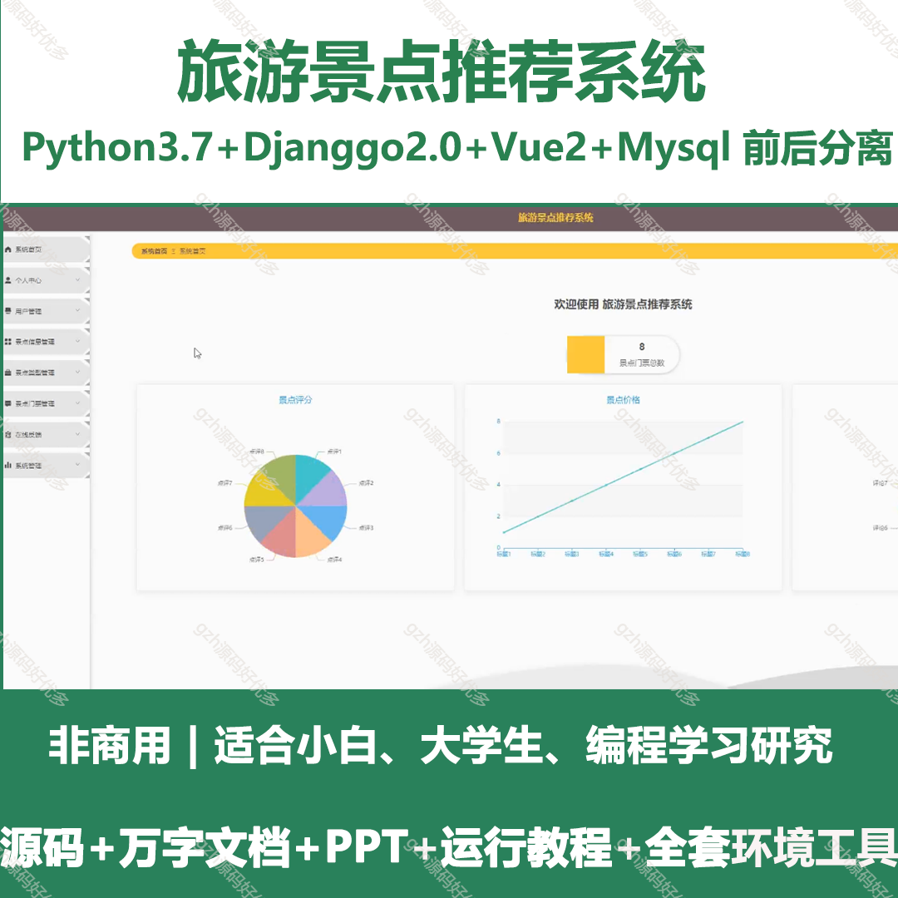
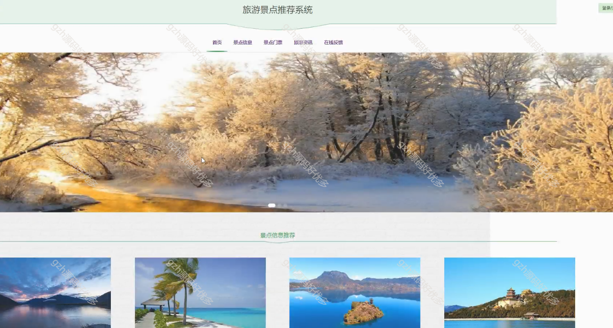
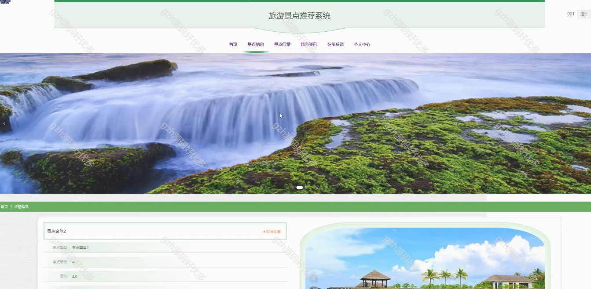
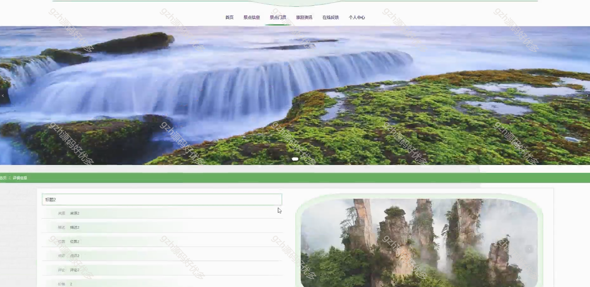
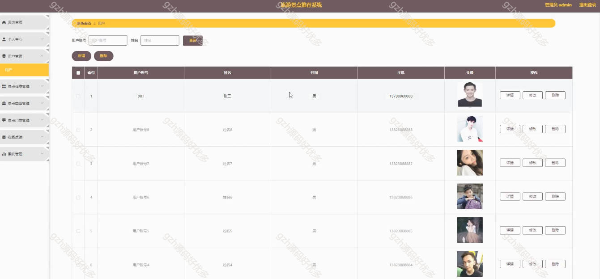
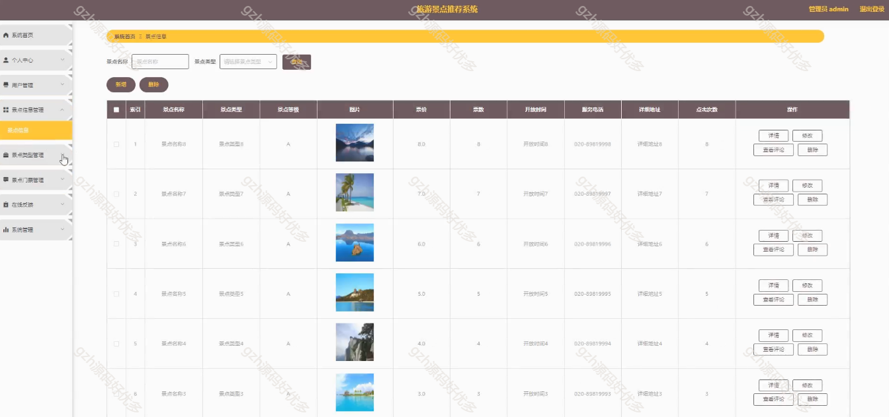
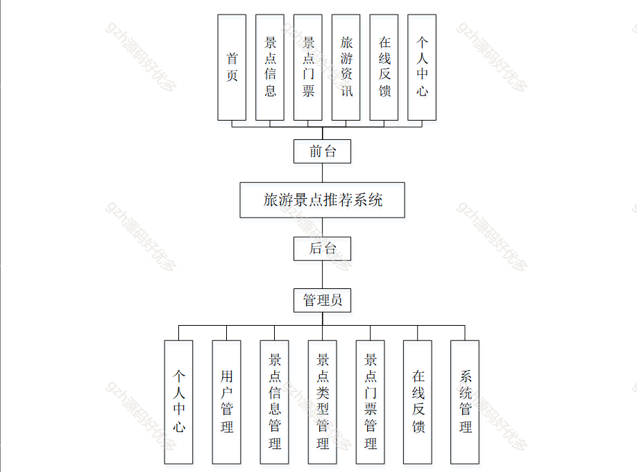
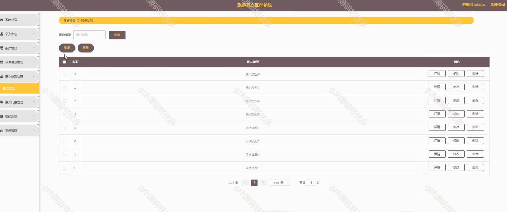

# python029
python029基于Python的旅游景点推荐系统
 
## 查看主页获取源码

### 一、关键词

旅游景点系统、旅游推荐系统

 

### 二、作品包含

源码+数据库+设计文档万字+PPT+全套环境和工具资源+部署教程

 

### 三、项目技术

前端技术：Html、Css、Js、Vue2.0、Element-ui
后端技术：Python3.7、Django2.0

  

 

### 四、运行环境（以下版本亲测，其他版本未知，请自测）

开发工具：PyCharm + VSCODE

数据库：MySQL5.7（最低要5.7版本）

数据库管理工具：Navicat10+

Python：Python3.7

前端Nodejs：14

浏览器：谷歌浏览器

 

### 五、项目介绍

项目编号：python029

相比于以前的传统旅游景点推荐手工管理方式，智能化的管理方式可以大幅降低景区的运营人员成本，实现了旅游景点推荐的标准化、制度化、程序化的管理，有效地防止了旅游景点推荐的随意管理，提高了信息的处理速度和精确度，能够及时、准确地查询和修正旅游景点推荐情况等信息。

统主要包括系统首页、个人中心、用户管理、景点信息管理、景点类型管理、景点门票管理、在线反馈、系统管理等功能，从而实现智能化的旅游景点推荐方式，提高旅游景点推荐的效率。

 

### 六、运行截图

